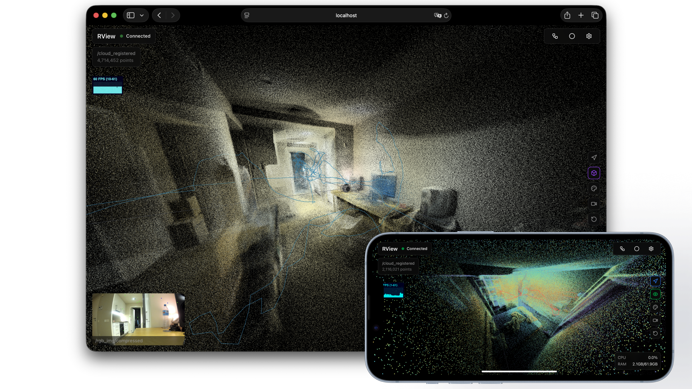

## Rview

This is yet another web based ROS visualization tool, similar to Foxglove but made for one specific purpose - showing pointclouds for handheld SLAM scanners on a phone. It should work nicely with FAST-LIO/LIVO or any similar SLAM framework.



## Features:

- Display point clouds (intensity and RGB rendering)
- Display TF paths
- Display camera images
- Start/stop rosbag recording for selected topics + show disk usage
- View/start/stop ROS nodes
- Show host RAM/CPU usage
- Record screen-capture videos (raw PNG or compressed), because why not

Connection to the ROS master happens through [Foxglove Bridge](https://github.com/foxglove/ros-foxglove-bridge), so it must be installed and running.  

If you want node control and rosbag management, you’ll also need [ros-supervisor](https://github.com/err4o4/ros-supervisor) on the master.

## Running:
```
git clone https://github.com/err4o4/rview.git
cd rview
docker build -t ros-view:latest .
docker run -p 3000:3000 ros-view:latest
```

If you want Rview to look like an app on mobile just add bookmark to the homescreen. 

## Pointcloud Viewer

Because this tool was designed with mobile devices in mind, several optimizations were added to make interacting with large clouds less painful.

#### Camera Modes  
Click the arrow on the right side of the viewer to switch modes:

- **arrow not highlighted** – free-move camera; stays where you put it  
- **blue arrow** – follows TF, but you control zoom and view angle  
- **red arrow** – places camera behind TF in a first-person style; zoom adjustable

#### TF Visualization Modes

- **crossed-out eye** – TF marker hidden  
- **green eye** – standard TF arrows  
- **purple box** – Wheatley from Portal 2

#### Useful Settings

Most settings are self-explanatory, but here are a few that matter:

```
- Decay time – how long points remain visible (oldest are removed after this time)
- Max points – removes oldest points once the limit is reached
- Point filter number – percentage of points added on every incoming cloud message

- Latest scan point size – enlarge points of latest scan for visibility
- Latest scan highlight mode – visually make the latest scan brighter (and red)
- Dynamic latest point scaling – scales distant latest points for better visibility

- TF smoothing – smooths jittery TF visualization
- Camera smoothing – smooths camera movement when locked to TF, because it is tied to tf
```
## Recorder  
*(This is the screen recorder, not the rosbag recorder.)*

You can record first person view videos, for example, if in TF-locked camera mode.  

Supported formats:

- H.264 / VP9 video with preset FPS and bitrate  
- Raw PNG sequence dumps — enormous files, absolutely not recommended on mobile (one PNG ≈ 3 MB) and you have to stitch them with ffmpeg. Check console for the command after it dumps zips to your PC/mobile. 

## Rosbag Recorder  
*(Requires ros-supervisor)*

Set the list of topics to record.  
Check [ros-supervisor](https://github.com/err4o4/ros-supervisor) docs to see where bags are stored.

## Nodes Manager  
*(Requires ros-supervisor)*

Configure a list of nodes you want to control via the UI:
```
- Node name  
- Launch file  
- Parameters  
```
You can also define **hidden nodes**, which will run silently without appearing in the node list in UI.

## Build
Development:
```
npm install
npm run dev
```
Production:
```
npm run build
npm start
```